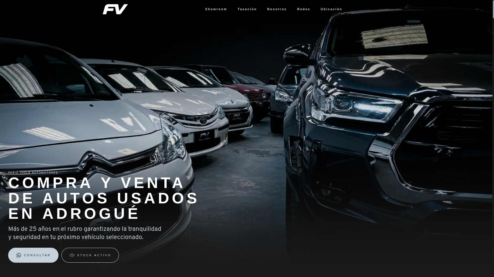
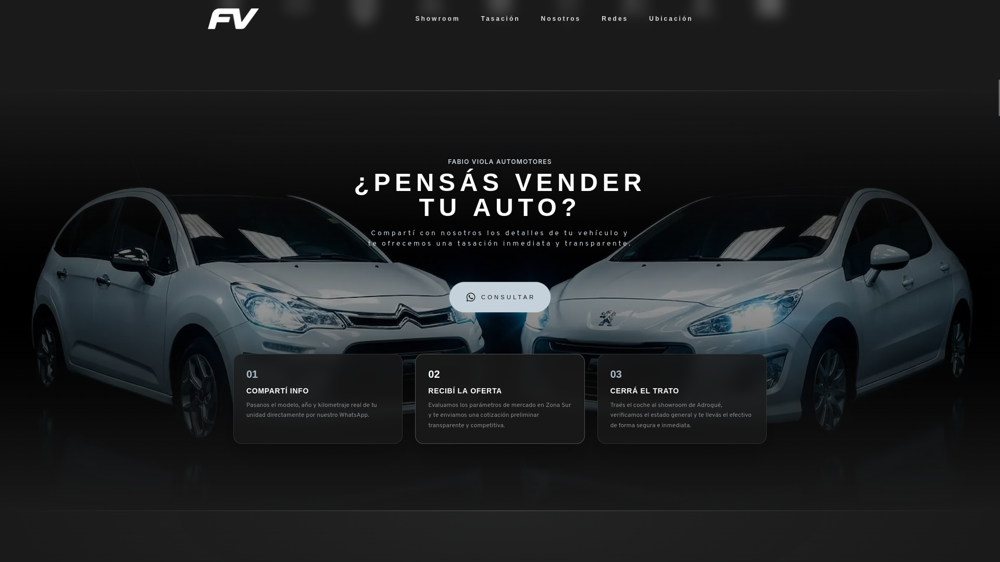
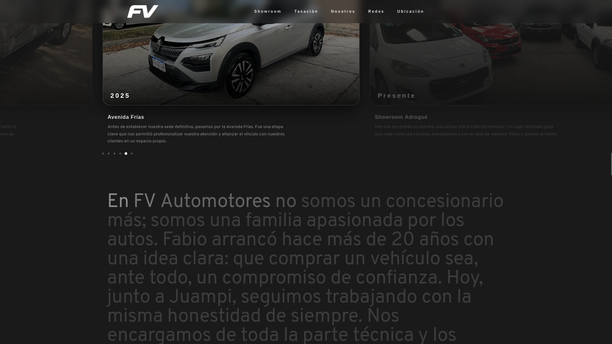
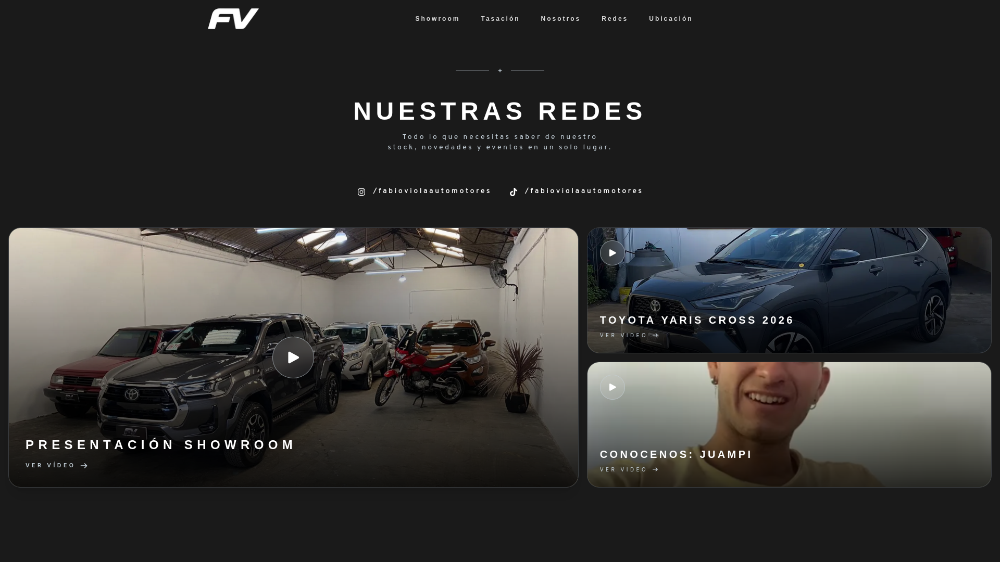
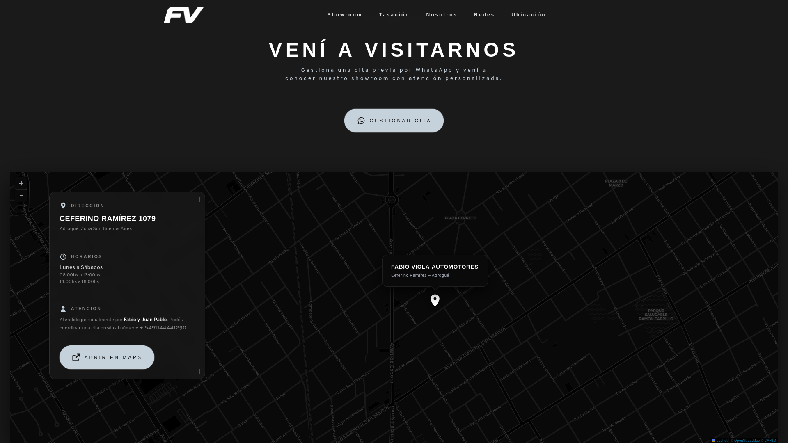
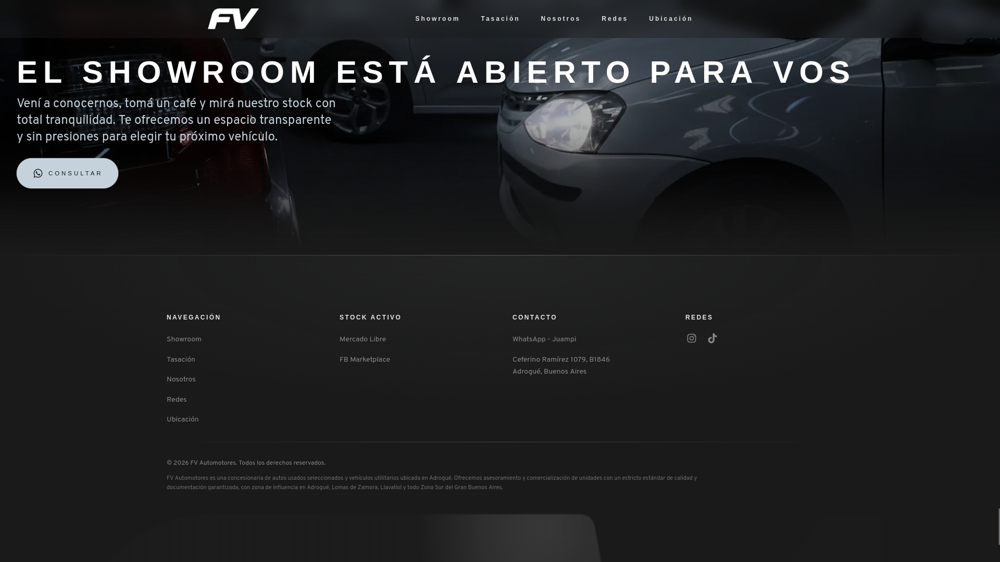

<p align="center">
  
</p>

<h1 align="center">Landing Page Fabio Viola Automotores</h1>

<p align="center">
  
  
  
  
  
  
</p>

---

## Screenshots








---

## Sobre el Proyecto

**FV Automotores** es la página web oficial de **Fabio Viola Automotores**, una concesionaria familiar de vehículos usados ubicada en **Adrogué, Zona Sur, Buenos Aires, Argentina**. Con más de **25 años de trayectoria** (fundada en 2001), el negocio está liderado por Fabio y su hijo Juan Pablo ("Juampi") Viola.

El sitio funciona como una vitrina digital premium que presenta la marca, su historia, los servicios que ofrece y canaliza a los clientes hacia las plataformas donde se publican los vehículos disponibles.

### Servicios del negocio

- **Compra y venta de autos usados** — actividad principal
- **Permutas** — aceptación de vehículos como parte de pago
- **Consignaciones** — venta de vehículos en nombre de terceros
- **Tasaciones** — evaluaciones transparentes de precio

---

## Funcionalidades

### Secciones del sitio

| Sección | Descripción |
|---|---|
| **Header** | Navbar fijo con logo animado (3 capas: base → cromado al hover → 25° aniversario), menú hamburguesa mobile con overlay completo |
| **Hero** | Pantalla completa con imagen de fondo, parallax y animaciones de entrada GSAP |
| **Showroom Online** | Puente hacia plataformas externas (Facebook Marketplace y Mercado Libre) con cursor personalizado |
| **Marcas** | Grid de 9 logos de fabricantes de autos con efecto glow al hover |
| **Vendé tu Auto** | CTA con link a WhatsApp y tarjetas del proceso en 3 pasos |
| **Sobre Nosotros** | Historia de la empresa con animación pinned "25 AÑOS de EXPERIENCIA", timeline arrastrable y reseñas de clientes |
| **Redes Sociales** | Links a Instagram y TikTok con grid de 3 videos de TikTok |
| **Ubicación** | Tarjeta de dirección + mapa interactivo Leaflet (tema oscuro CARTO) |
| **FAQ** | 7 preguntas frecuentes en acordeón con Schema.org y videos de TikTok opcionales |
| **Footer** | CTA final con WhatsApp + footer completo con navegación, contacto y efecto spotlight siguiendo el mouse |

### Página 404

Página de error personalizada con hero y sección de inventario que invita a volver al showroom.

### Características interactivas

- Animaciones de scroll con **GSAP ScrollTrigger** (reveal de texto palabra por palabra, parallax, secciones pinned)
- **Timeline horizontal arrastrable** con GSAP Draggable e inercia
- **Cursors personalizados**: "INGRESAR" en links del stock, "< >" en el timeline
- **Efecto spotlight** en el logo del footer que sigue al mouse
- **Smooth scrolling** para navegación entre secciones
- **Acordeón FAQ** con animación CSS (`interpolate-size: allow-keywords`)

---

## Stack Tecnológico

| Tecnología | Versión | Uso |
|---|---|---|
| [Astro](https://astro.build/) | ^6.3.3 | Generador de sitio estático / meta-framework |
| [Tailwind CSS](https://tailwindcss.com/) | ^4.3.0 | Estilos utility-first (vía plugin Vite) |
| [GSAP](https://greensock.com/gsap/) | ^3.15.0 | Animaciones (core + ScrollTrigger + Draggable) |
| [TypeScript](https://www.typescriptlang.org/) | Strict | Tipado estático |
| [Leaflet](https://leafletjs.com/) | 1.9.4 | Mapa interactivo (carga dinámica) |
| [pnpm](https://pnpm.io/) | — | Gestor de paquetes |

**Nota:** El sitio está construido completamente con **componentes Astro puros** (sin React, Vue ni Svelte). El JavaScript se envía al cliente solo cuando es necesario (scripts inline en componentes).

---

## Estructura del Proyecto

```
fvautomotores-web/
├── astro.config.mjs              # Configuración de Astro (Tailwind v4, sitemap, path alias)
├── package.json                  # Dependencias y scripts
├── tsconfig.json                 # Configuración TypeScript con alias @/
│
├── public/                       # Assets estáticos
│   ├── fonts/                    # Fuentes custom (Microgramma D Extended, Overpass Variable)
│   ├── *.webp                    # Imágenes (hero, footer, timeline, testimonios, etc.)
│   ├── *.svg                     # Logos (base, cromado, 25° aniversario, footer)
│   └── favicon.*                 # Favicons + manifest PWA
│
├── src/
│   ├── pages/                    # Páginas
│   │   ├── index.astro           # Homepage (single-page con todas las secciones)
│   │   └── 404.astro             # Página de error personalizada
│   │
│   ├── layouts/
│   │   └── Layout.astro          # Layout base (head, meta, fuentes, ClientRouter)
│   │
│   ├── sections/                 # Secciones de la página (10)
│   │   ├── Header.astro          # Navbar fijo con logo animado
│   │   ├── Hero.astro            # Hero fullscreen con parallax
│   │   ├── Inventory.astro       # Showroom Online (links a plataformas externas)
│   │   ├── Brands.astro          # Grid de marcas de autos
│   │   ├── SellYourCar.astro     # CTA "Vendé tu Auto"
│   │   ├── About.astro           # Historia, timeline y reseñas
│   │   ├── Socials.astro         # Redes sociales y videos
│   │   ├── Location.astro        # Dirección + mapa Leaflet
│   │   ├── FAQ.astro             # Preguntas frecuentes (acordeón)
│   │   └── Footer.astro          # Footer + CTA final
│   │
│   ├── components/               # Componentes reutilizables (11)
│   │   ├── Button.astro          # Botón CTA con variantes glass/plata
│   │   ├── SectionHeader.astro   # Título + subtítulo de sección
│   │   ├── SectionDivider.astro  # Divisor decorativo con estrella
│   │   ├── SectionGlowDivider.astro  # Separador con glow
│   │   ├── StockBridge.astro     # Links a plataformas con cursor custom
│   │   ├── VehicleBadge.astro    # Badge de especificaciones del vehículo
│   │   ├── Timeline.astro        # Timeline horizontal arrastrable (GSAP)
│   │   ├── Us.astro              # Texto "Sobre nosotros" con reveal en scroll
│   │   ├── Reviews.astro         # Tarjetas de testimonios (masonry)
│   │   ├── SocialGrid.astro      # Grid de videos de TikTok
│   │   └── AboutLayerLayering.astro  # Animación pinned "25 AÑOS"
│   │
│   ├── consts/                   # Datos constantes
│   │   ├── faq.ts                # 7 items de FAQ
│   │   └── testimonials.ts       # 6 testimonios de clientes
│   │
│   ├── assets/svg/               # Iconos SVG y logos de marcas
│   │   ├── car-brands/           # 9 logos de fabricantes
│   │   └── *.svg                 # Iconos UI (whatsapp, instagram, flechas, etc.)
│   │
│   └── styles/
│       └── global.css            # Configuración Tailwind v4, tema custom, fuentes
```

---

## Diseño y UX

### Identidad Visual

- **Estética**: Oscura y premium, orientada al sector automotor
- **Fondo principal**: Antracita (`#1A1A1A`)
- **Acentos**: Plata/platino para highlights, azul (`#0055FF`) para elementos interactivos
- **Paleta custom**: 3 escalas definidas como tokens de tema en Tailwind v4:
  - `fvantracita` — grises para fondos y texto
  - `fvplata` — tonos plateados para acentos y divisores
  - `fvazul` — tonos azules para interacciones

### Tipografía

| Fuente | Uso |
|---|---|
| **Microgramma D Extended Bold** | Títulos, navegación, badges — display, todo en mayúsculas con letter-spacing amplio |
| **Overpass** (Variable) | Texto body, descripciones, UI |

Ambas cargadas con `font-display: swap` y preload en `<head>`.

### Animaciones (GSAP)

- **Hero**: Fade-up de texto, blur→claro en botones, parallax de imagen de fondo
- **Logo**: Animación de 3 capas (base → 25° aniversario → base)
- **Nav underlines**: Clip-path animado al hover
- **Timeline**: Draggable horizontal con snap e inercia
- **Text reveal**: Opacidad palabra por palabra en scroll (ScrollTrigger)
- **Layer animation**: Sección pinned "25 AÑOS" → "EXPERIENCIA"
- **Footer spotlight**: Gradiente radial que sigue al mouse sobre el logo
- Todas las animaciones respetan `prefers-reduced-motion: reduce`

### Responsive Design

- Enfoque **mobile-first** con breakpoints `sm:`, `md:`, `lg:`, `xl:`
- Menú hamburguesa con overlay completo y soporte de teclado (Escape para cerrar)
- Layouts adaptativos: grid de marcas, masonry de reseñas, FAQ, footer, mapa
- Cursores personalizados deshabilitados en touch devices

### Accesibilidad

- HTML semántico: `<header>`, `<nav>`, `<main>`, `<footer>`, `<section>`, `<details>/<summary>`
- Atributos ARIA: `aria-label`, `aria-labelledby`, `aria-hidden`, `aria-expanded`, `aria-controls`
- Atributo `inert` en menú mobile cuando está cerrado
- `focus-visible` rings en elementos interactivos
- Contenido `.sr-only` para SEO y lectores de pantalla
- Navegación completa por teclado

---

## Integraciones Externas

| Servicio | Uso |
|---|---|
| **WhatsApp Business** | Canal de contacto principal (`wa.me/5491144441290`) con mensajes pre-cargados |
| **Mercado Libre** | Publicación de vehículos disponibles |
| **Facebook Marketplace** | Publicación de vehículos disponibles |
| **Instagram** | Red social — `@fabioviolaautomotores` |
| **TikTok** | Red social y contenido — `@fabioviolaautomotores` (tutoriales, showroom, showcases) |
| **Google Maps** | Dirección y navegación al local |
| **Leaflet + CARTO** | Mapa interactivo con tiles oscuros |
| **Google Search Console** | Verificación y monitoreo SEO |

---

## SEO y Performance

- **Schema.org**: Datos estructurados `FAQPage`, `Question`, `Answer` en la sección de FAQ
- **Sitemap**: Generado automáticamente con `@astrojs/sitemap`
- **Meta tags**: Open Graph, descripciones, favicon completo (ICO, SVG, PNG, Apple Touch Icon)
- **Optimización de imágenes**: Formato WebP, `loading="lazy"`, `decoding="async"`, preload de imagen hero con `fetchpriority="high"`
- **Fuentes**: Preload crítico, `font-display: swap`
- **JavaScript mínimo**: Componentes Astro puros, GSAP cargado solo donde se necesita
- **Leaflet**: Carga dinámica (no incluido en el bundle principal)
- **Performance**: `will-change` en animaciones, `passive: true` en listeners de scroll, `AbortController` para cleanup de eventos

---

## Requisitos

- **Node.js** >= 22.12.0
- **pnpm** (gestor de paquetes)

---

## Instalación y Desarrollo

```bash
# Clonar el repositorio
git clone <url-del-repositorio>
cd fvautomotores-web

# Instalar dependencias
pnpm install

# Iniciar servidor de desarrollo
pnpm dev

# Build de producción
pnpm build

# Vista previa del build
pnpm preview
```

---

## Licencia

Proyecto privado — Fabio Viola Automotores © 2025
